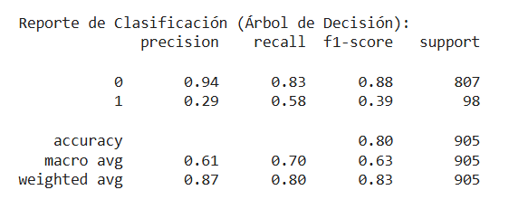
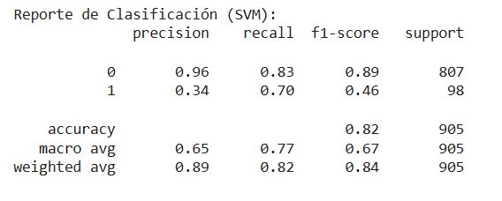

#### UNIVERDIDAD DE ESPECIALIDADES ESPIRITU SANTO

**MATERIA:** APRENDIZAJE AUTOMÁTICO

**PROFESOR**: ING. GLADYS MARÍA VILLEGAS RUGEL

**INTEGRANTES:**
- DAMARIS ALARCÓN
- CHRISTIAN GARCÍA
- BYRON PIEDRA
- IVAN CHÉRREZ

***OBJETIVO*:**
Este proyecto utiliza técnicas de aprendizaje automático para predecir si un cliente aceptará o no una oferta de producto bancario, basándose en un conjunto de variables socioeconómicas y comportamentales.

**BASE DE DATOS: Bank_Marketing**

Link: https://archive.ics.uci.edu/dataset/222/bank+marketing

Descripción: Los datos corresponden a campañas de marketing directo desde una entidad bancaria portuguesa. Durante las campañas, ofrecían depósitos a plazo fijo a sus clientes mediante llamadas telefónicas. El objetivo es predecir si un cliente aceptará realizar el depósito a plazo fijo tras una llamada telefónica. Al realizar el análisis exploratorio de los datos se identificó a la variable “y” como la variable objetivo en el modelo. La variable “Y” corresponde a si el cliente accede a realizar el depósito a plazo fijo, es vinaria y tiene los valores de “si” y “no”.  

**VARIABLES DE ENTRADA:**

Additional Variable Information
Input variables:
   1 - age (numeric)
   2 - job : type of job (categorical: "admin.","unknown","unemployed","management","housemaid","entrepreneur","student", "blue-collar","self-employed","retired","technician","services") 
   3 - marital : marital status (categorical: "married","divorced","single"; note: "divorced" means divorced or widowed)
   4 - education (categorical: "unknown","secondary","primary","tertiary")
   5 - default: has credit in default? (binary: "yes","no")
   6 - balance: average yearly balance, in euros (numeric) 
   7 - housing: has housing loan? (binary: "yes","no")
   8 - loan: has personal loan? (binary: "yes","no")
   9 - contact: contact communication type (categorical: "unknown","telephone","cellular") 
  10 - day: last contact day of the month (numeric)
  11 - month: last contact month of year (categorical: "jan", "feb", "mar", ..., "nov", "dec")
  12 - duration: last contact duration, in seconds (numeric)
  13 - campaign: number of contacts performed during this campaign and for this client (numeric, includes last contact)
  14 - pdays: number of days that passed by after the client was last contacted from a previous campaign (numeric, -1 means client was not previously contacted)
  15 - previous: number of contacts performed before this campaign and for this client (numeric)
  16 - poutcome: outcome of the previous marketing campaign (categorical: "unknown","other","failure","success")
  Output variable (desired target):
  17 - y - has the client subscribed a term deposit? (binary: "yes","no")

**PREPROCESAMIENTO DE LOS DATOS:**

En el preprocesamiento de los datos, inicialmente se codificó todas las variables categóricas como estado civil, la profesión y el mes en el que se realizó las llamadas para tomarlas en cuenta en el entrenamiento del modelo. Sin embargo, se determinó que algunas variables no aportaban al rendimiento del modelo y generaban ruido, por lo que fueron eliminadas. Las variables eliminadas fueron: 'job', 'contact', 'day', 'month','previous', 'poutcome'.
Por otro lado, se transformaron las variables bionarias: 'default', 'housing', 'loan' y 'y'. Finalmente, se obtuvo las mejores métricas posibles con las variables: 'age','default','balance','housing','loan','duration','campaign','pdays'.  Se realizó el escalado de los datos para normalizar sus características y se dividió el con junto de datos en 80% para entrenamiento y 20% para prueba.

**MODELOS:**
1.	Árbol de decisión:
Este modelo se entrenó inicialmente con el parámetro max_depth=4, se obtuvo las siguientes métricas: 

Al validar este modelo se determinó que se puede optimizar su rendimiento con el parámetro max_depth=10 y class_weight="balanced", que se utiliza cuando las clases no están representadas equitativamente (clientes de aceptan el depósito a plazo fijo). Las métricas obtenidas fueron las siguientes:

 
Finalmente, se utilizó SMOTE para dar prioridad a las clases minoritarias, debido a la gran diferencia entre clientes que sí aceptaron y clientes que no aceptaron. Las métricas finales fueron:
 

**SVM:**

Modelo 1

 
Modelo 2

Modelo 3

**RANDOM FOREST:**

Modelo 1

Modelo 2

***CONCLUSIONES*:**
Se dio prioridad al aumento de Recall sobre Precisión, ya que en este caso nos interesa maximizar el recall de la clase 1 (clientes que aceptan), es decir, identificar la mayor cantidad de posibles clientes que acepten el depósito a plazo fijo. Siendo el objetivo principal del marketing: encontrar a los clientes que realmente aceptarán.
Es posible que el bajo rendimiento en la precisión de la clase 1 se deba a características intrínsecas de la base de datos que estás utilizando. Los datos desbalanceados o las características del conjunto de datos pueden afectar el rendimiento del modelo.
La base de datos Bank Marketing tiene un desbalance importante entre las clases (en general, las personas que aceptan productos bancarios son mucho menos que las que no lo hacen), lo que hace que cualquier modelo tenga dificultades para clasificar correctamente la clase 1.  Si la base de datos tiene un desbalance de clases significativo, donde la clase 1 es mucho menos frecuente que la clase 0, el modelo puede tener dificultades para predecir correctamente la clase minoritaria.
